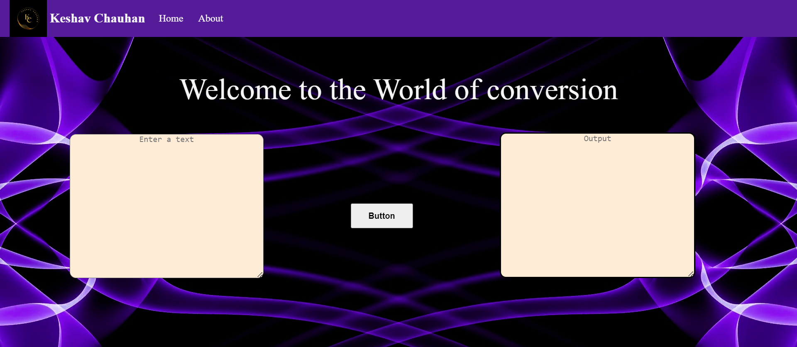
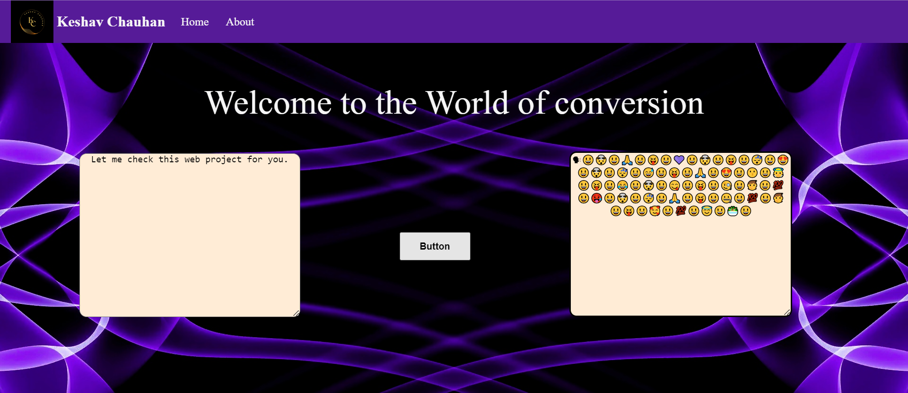
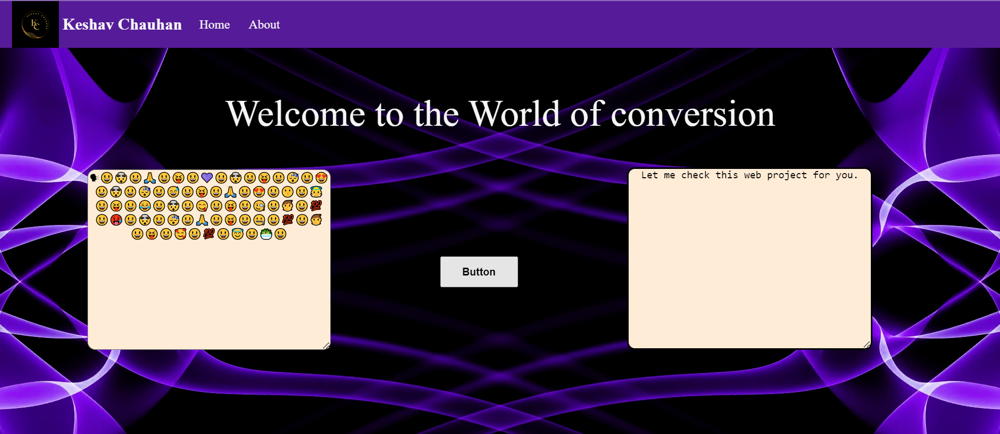

> # Encryption and Decryption of text

## Description

This project is based on basics of cryptography where it takes text as input and provide a simple and encrypted emojis based output and vise-versa.


## Features

- **User-Friendly Interface:** This web project provides an intuitive interface for users to input their text.

- **Instant Results:** Users get instant results displaying encrypted or decrypted form of text.


## Sample Images
- **First View**


- **Encryption View**


- **Decryption View**



## How to use

1. **Clone the Repository**
   - Click on the "Code" button to reveal the repository's URL.

   - Copy the repository URL.

   - Open your terminal or command prompt.

   - Use the `git clone` command followed by the repository URL to clone the repository to your local machine.

    Example:
    ```bash
    git clone https://github.com/your_username/repository-name.git
    ```

2. **Navigate to the Project Directory**
   - Once the repository is cloned, navigate to the project directory using the `cd` command.

   Example:
   ```bash
    cd repository-name
   ```

3. **Run the project**
   - Double click on the `index.html` file to open it in web browser. 

4. **Input and result**
   - Once the project is running, enter the text for encryption or emojis for decryption.

   - Click on the Button and then get you output as encrypted form or decrypted form.


## Disclaimer

This project is based on simple cryptography technique.You can try it for simple thing or fun activity but not for your really important information. So, do not use this for encrypting your confidential information.